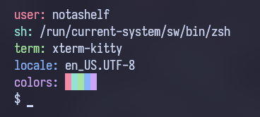

# tinierfetch

it's tinyfetch but also tinier - you could probably fit this in a QR code
takes `0.001` to `0.003s` to fetch

edit: it fits in a [QR code](./assets/qr.png)

## depends

a compiler (I used g++) and `TERM`, `LANG`, `USER`, `SHELL` environmental variables to be set

## preview

